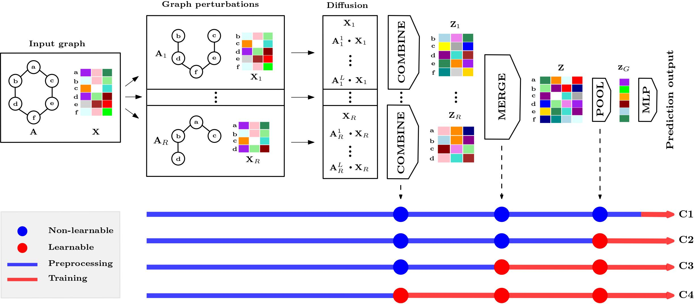

Scalable Expressiveness through Preprocessed Graph Perturbations (SE2P)
===============================================================================
This is a pytorch implementation of the paper Scalable Expressiveness through Preprocessed Graph Perturbations.

Please read our paper at

## SE2P framework

We introduce Scalable Expressiveness through Preprocessed Graph Perturbation (SE2P), a model combining flexibility, 
scalability, and expressiveness. Our approach offers four configuration classes, each offering a unique balance between scalability
and generalizability. Through preprocessing, SE2P generates multiple perturbations of the input graph by a perturbation policy 
(e.g., random node removal) and diffuses nodal features across each perturbed graph. SE2P leverages the expressive power offered
by multiple perturbed graphs to surpass 1-WL expressiveness limits. The flexibility of SE2P is of practical importance, allowing
for the selection of learnable or non-learnable aggregation functions and thus enabling scalable or expressive variations of many
models.

## Requirements

  * Python 3.8
  * For the other packages, please refer to the requirements.txt.

## Getting Started
To run SE2P configuration on the TU benchmark datasets run `SE2P.py`. You can specify the following arguments:

- `dataset` - The dataset from the TU benchmark, including MUTAG, PROTEINS, PTC_GIN, IMDB-BINARY, IMDB-MULTI, and COLLAB.
- `configuration` - Which configurations to select, options are c1, c2, c3, and c4.
- `L` - The number of (virtual) layers in the diffusion step.  
- `n_f` - Number of layers in the final MLP (decoder).
- `n_p` - Number of layers in the MLP of the POOL function. Needed for c2, c3, and c4.
- `ds_mi` - Number of layers in the inner MLP of the DeepSet for the MERGE function. Needed for c3 and c4.
- `ds_mo` - Number of layers in the outer MLP of the DeepSet for the MERGE function. Needed for c3 and c4.
- `ds_ci` - Number of layers in the inner MLP of the DeepSet for the COMBINE function. Needed for c4.
- `ds_co` - Number of layers in the outer MLP of the DeepSet for the COMBINE function. Needed for c4.
- `h` - The hidden dimentionality of the hidden layers.
- `graph_pooling` - If set to "attention_agg", attentional aggregation will be used for the POOL function. In our experiments, "sum" is used.
- `batch_size` - The batch size of the model.
- `seed` - Seed for reproducibilty. Default is 0.
- `epochs` - Number of epochs for training. For TU datasets 350 is used.
- `batch_norm` - Whether to use batch normalization or not.

To run SE2P on the OGB benchmark datasets, run OGBG.py. All the arguments are same as TU benchmark, except for the following:
- `dataset` - Select either "ogbg-molhiv" or "ogbg-moltox21".
- `epochs` - Number of epochs, which 100 is used on this benchmark.

## Acknowledgements

The `DROPGNN.py` file, which aims at reproducing the results of the DropGNN paper, is based on "Dropout Graph Neural Network" code by Papp et al. (https://github.com/KarolisMart/DropGNN)

## Citing Us/BibTex
Please cite our work if you find it useful in any way.

